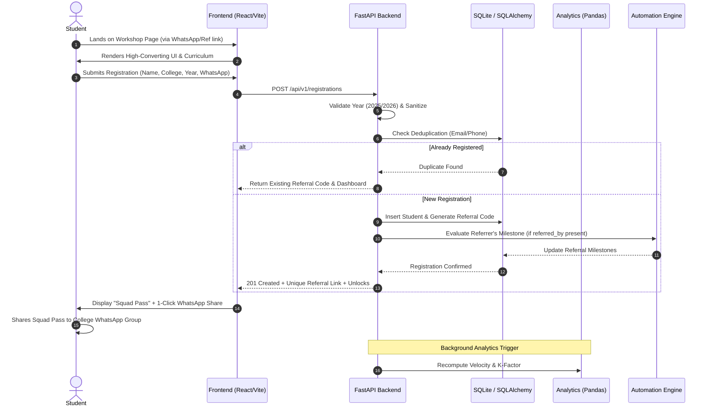

# System Architecture: AI Student Growth Engine

## 1. System Overview
The **AI Student Growth Engine** is an enterprise-grade growth and acquisition platform architected to achieve **500 verified final-year engineering student registrations** for NxtWave's free masterclass *"Build Your First AI Project in 60 Minutes"* within a **7-day sprint** on a strict **₹2,000 budget**.

The architecture combines a high-performance **React + TypeScript** frontend with a modular **FastAPI** backend, backed by **SQLite/SQLAlchemy** persistence, a **Pandas/NumPy** growth analytics pipeline, an **AI Provider Layer** with zero-cost deterministic fallbacks, an **Automation Layer** for viral referral loops, and a **Monte Carlo Growth Simulation Engine**.

```
+---------------------------------------------------------------------------------------+
|                                    PRESENTATION LAYER                                 |
|  +---------------------------------------------------------------------------------+  |
|  |             React 18 + TypeScript + Vite + Tailwind CSS + shadcn/ui             |  |
|  |  [High-Converting Landing Page]   [Interactive AI Teaser]   [Viral Squad Pass]  |  |
|  |  [College Leaderboard]            [Urgency Counter]         [Growth Analytics]  |  |
|  +---------------------------------------------------------------------------------+  |
+-------------------------------------------|-------------------------------------------+
                                            | REST API / JSON (Axios/Fetch)
                                            v
+---------------------------------------------------------------------------------------+
|                                   APPLICATION BACKEND                                 |
|  +---------------------------------------------------------------------------------+  |
|  |                  FastAPI (Asynchronous REST API Gateway)                        |  |
|  |  [CORS Middleware]  [Rate Limiting]  [Input Validation]  [Structured Logging]    |  |
|  +---------------------------------------------------------------------------------+  |
|           |                       |                       |                      |    |
|           v                       v                       v                      v    |
|   +---------------+       +---------------+       +---------------+      +----------+ |
|   |   DATABASE    |       |   ANALYTICS   |       |   AI ENGINE   |      |AUTOMATION| |
|   |     LAYER     |       |    ENGINE     |       |   PROVIDER    |      |  LAYER   | |
|   +---------------+       +---------------+       +---------------+      +----------+ |
|   | SQLite        |       | Pandas / NumPy|       | Base Provider |      | WhatsApp | |
|   | SQLAlchemy 2  |       | K-Factor Calc |       | OpenAI/Gemini |      | Referral | |
|   | Deduplication |       | Funnel Dropoff|       | Deterministic |      | Webhooks | |
|   | Cohort Filters|       | Leaderboards  |       | Fallback      |      | Milestones| |
|   +---------------+       +---------------+       +---------------+      +----------+ |
|           ^                                                                           |
|           |                                                                           |
|   +---------------+                                                                   |
|   |  SIMULATION   |                                                                   |
|   |    ENGINE     | <-- Parametric Monte Carlo Viral Trajectory (7-day forecast)      |
|   +---------------+                                                                   |
+---------------------------------------------------------------------------------------+
```

---

## 2. Component Architecture

### 2.1 Presentation Layer (`/frontend`)
* **Technology:** React 18, TypeScript, Vite, Tailwind CSS, Lucide React, Recharts.
* **Responsibilities:**
  * **Landing Page:** Sub-second mobile load, responsive layout, clear value proposition, curriculum breakdown.
  * **Interactive AI Sandbox:** Client-side interactive teaser demonstrating workshop outcomes without consuming third-party API tokens.
  * **Squad Pass Modal / View:** Personalized referral dashboard displaying referral count, dynamic unlock badges, and deep WhatsApp share triggers.
  * **Analytics Visualizer:** Interactive charts (registrations over time, college breakdown, channel attribution) built with Recharts.

### 2.2 API & Application Gateway (`/backend`)
* **Technology:** FastAPI, Uvicorn, Pydantic v2.
* **Responsibilities:**
  * Strict request validation and sanitization.
  * Route handlers for `/api/v1/health`, `/api/v1/registrations`, `/api/v1/referrals`, `/api/v1/analytics`, and `/api/v1/simulation`.
  * Middleware for CORS, request timing, and structured error responses.

### 2.3 Persistence & Data Layer (`/database`)
* **Technology:** SQLite (development/portability) with SQLAlchemy 2.0 ORM; transparently migratable to PostgreSQL.
* **Entities:**
  * `StudentRegistration`: Full name, email, WhatsApp, college name, department, graduation year, qualification flag, referral code, referred by, timestamp, UTM params.
  * `ReferralActivity`: Log of referral invitations, clicks, conversions, and reward unlock states.
  * `CampusLeaderboard`: Aggregated metrics by engineering college.

### 2.4 Analytics Engine (`/analytics`)
* **Technology:** Pandas, NumPy.
* **Responsibilities:**
  * Compute the **Viral Coefficient ($K$-factor)**: $K = i \times c$ where $i$ is invitations per user and $c$ is conversion rate per invite.
  * Real-time funnel conversion metrics (Visitors $\rightarrow$ Form Starters $\rightarrow$ Completed Registrations $\rightarrow$ Active Referrers).
  * Cohort velocity (registrations per hour/day across the 7-day window).

### 2.5 AI Layer (`/ai`)
* **Architecture:** Abstract Provider Pattern (`BaseAIProvider`).
* **Implementations:**
  * `OpenAIProvider`: Direct LLM API integration.
  * `GeminiProvider`: Google AI integration.
  * `DeterministicFallbackProvider`: Robust, offline-capable fallback returning intelligent, context-aware responses without requiring paid API keys or network calls.
* **Resilience:** Automatic fallback triggering if remote API fails, times out, or quota is exhausted.

### 2.6 Automation Layer (`/automation`)
* **Responsibilities:**
  * Dynamic WhatsApp deep link generation (`https://wa.me/?text=...`) with pre-composed viral copy.
  * Event-driven milestone evaluator checking if a referrer has hit 1 or 3 successful referrals.
  * Digital ticket and calendar invite (.ics) generator.

### 2.7 Simulation Layer (`/simulation`)
* **Technology:** Monte Carlo / discrete-event simulation in Python.
* **Responsibilities:**
  * Simulates 7-day viral spread under varying assumptions:
    * Organic daily baseline (15–30 direct signups/day).
    * Referral invitation rate ($i = 1.2$ to $2.5$ shares per user).
    * Referral conversion rate ($c = 25\%$ to $45\%$).
    * Budget deployment timing (Day 1 vs Day 3 micro-boosts).
  * Validates whether the 500-student threshold will be reached within the ₹2,000 budget constraint.

---

## 3. End-to-End Data Flow



---

## 4. Security & Quality Standards
1. **Input Validation:** Strict Pydantic models validate email RFC compliance, 10-digit Indian phone numbers, and graduation year gating.
2. **Deduplication:** Unique constraints on email and phone numbers prevent spamming the 500 registration quota.
3. **Graceful Degradation:** AI features use the `DeterministicFallbackProvider` when external keys are absent.
4. **Environment Isolation:** Zero credentials in code; 100% environment-driven via `.env`.
